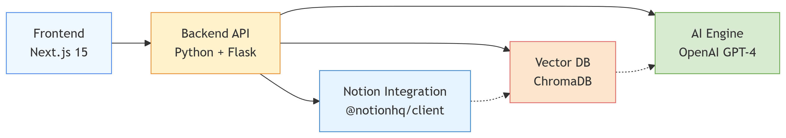

# 1. Архитектуа проекта PM-assistant



1. Frontend отправляет вопрос пользователя на Backend API
2. Backend обрабатывает запрос и взаимодействует с другими сервисами:
  - Через Notion Integration получает доступ к базе знаний
  - В Vector DB ищет релевантные фрагменты информации
  - Передаёт найденные данные в AI Engine для генерации ответа
  - Backend возвращает готовый ответ с источниками на Frontend
3. Связь Notion → Vector DB: Данные из Notion периодически загружаются и индексируются в векторной базе для быстрого поиска.


## Структура проекта

```
Frontend (Next.js 15)
/frontend
  /components
    Chat.jsx           # компонент чата
    Message.jsx        # сообщение
    SourceList.jsx     # список источников
  /app
    page.js            # главная страница    
  /utils
    apiClient.ts       # функции для работы с backend API
  /styles
    globals.css

Backend (Python + Flask)
/backend
  main.py               # Flask приложение
  /routes
    ask.py              # обработчик запросов пользователя
  /services
    notion_client.py    # коннектор к Notion API
    embeddings.py       # генерация эмбеддингов
    chroma_client.py    # работа с ChromaDB
    ai_engine.py        # запросы к OpenAI, формирование ответа
  /utils
    config.py           # ключи и настройки

База знаний
/data
  raw/                  # выгруженные страницы из Notion
  embeddings/           # сохранённые эмбеддинги
  chroma/               # данные ChromaDB

Документация
/docs
  requirements.md       # требования
  architecture.md       # архитектура
  api.md                # описание API
  plan.md               # план работы над проектом

```